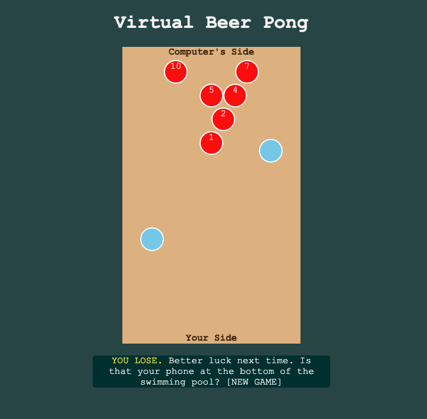
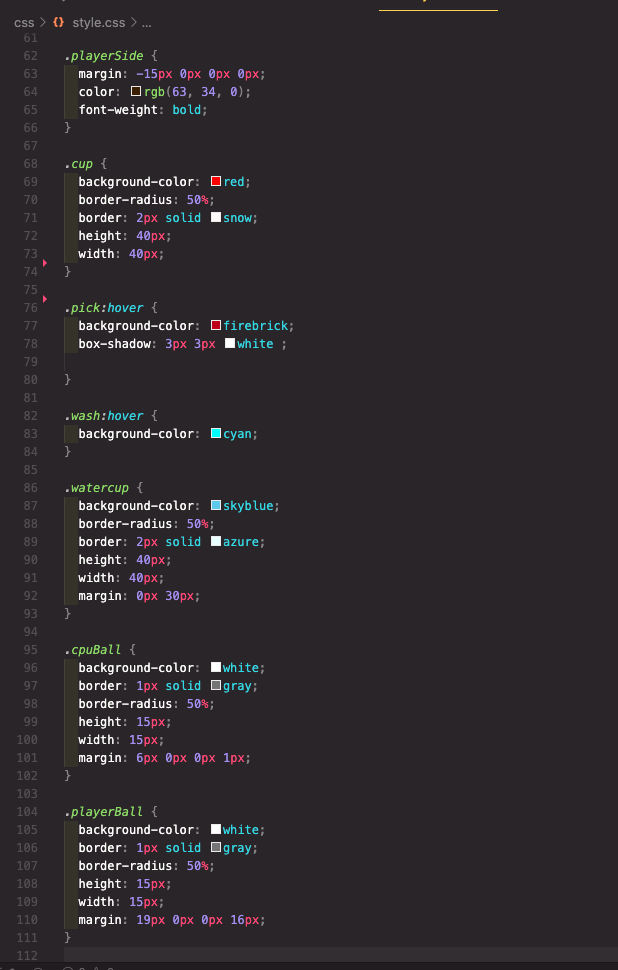

# Beer-Pong

This is a game I built for General Assembly's Software Engineering Immersive's Unit 1, showcasing the use of HTML, CSS, and Javascript. This app is in its beginning stages of development, currently offering a 10 cup volley against a computer. Get ready to bounce some balls and grip a dip in some bubbly with a game of Beerpong! Play an engaging game against the computer: pick the cup you're aiming at and decide where to aim. Depending on how you do, you might hit it, miss it, or it might bounce off the cup and take out another cup. 

### Motivation
I was interested in creating a unique cheeky game with the potential for dynamic user interactivity. Beerpong is a game that is easy to understand for novices, but also can stir up good memories in those seasoned veterans. Whether you're new to the game or not, you're likely to have a good time. 

### Screenshots

### User Stories & Wireframes
On the users turn, the use must wash the ball before they select a target. If they don't wash the ball a reminder will pop up to let them know they must wash the ball first. Once a target is selected the user clicks a button to see what happens. The ball either misses, hits the cup they aimed for, or bounces off that cup and lands in another cup. On the computers turn, the user clicks to see what happens. The application automatically calculates the target, takes aim, and results in one of possible consequences of the ball. The first player, the use or the computer, to knock out all 10 cups on their opponents side wins! 

### Technologies & Code Snippets
* HTML
* CSS
* Javascript

### Credits
Many kudos to the GA instructors and TAs for their unrelenting patience and assistance during pivotal moments of debugging. Thank you especially to James Sinkler and Brock Whitbred-Cole whose code I referenced several times (PokeASquare and events-practice, respectively) and Jacob Kleiman whose High-Card tutorial taught me more elegant and succinct ways of DOM manipulation. Finally, big thanks to my peers for the confident enthusiasm anticipating my finished product and ongoing encouragement.

### Future development
The next step is to increase user engagement by adding a "bounce the ball" shot option (that can earn 2 cup removal). This adds user input and interaction in two ways: (1) the user can choose between two options when taking a shot (laser shot or bounce the ball) and (2) if and when the computer bounces the ball the user can provide input that may smack the ball out of the way, blocking the shot. Successfully bouncing a ball into the cups results in two cup removal from the opponents rack. This will add to the number possibilities within the game and potential outcomes--making the game more dynamic and potentially more interesting.

Future iterations of this game will include reracking the cups when there are 6, 3, and 1 cup remaining in the rack. Reracking is a common feature of gameplay in real life, thus adding this feature will make this virtual game more realistic.

Finally, animiation and styling will be developed to add dimension to the user experience. Text click prompts will be changed to styled buttongs. Cup transitions and ball animation will be added during gameplay. Finally, graphic arts can be added to make the objects more realistic and 3-dimensional. 

### GitHub Link
https://smashflashtech.github.io/Project-BeerPong/